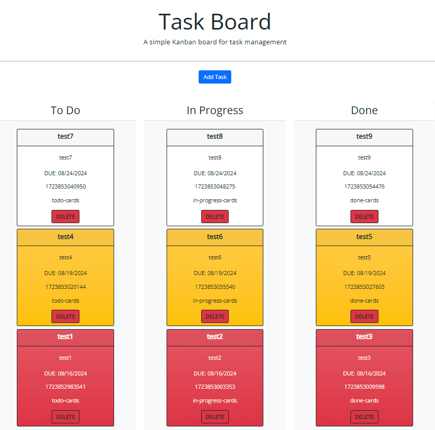

# task-board

<strong> Welcome to the track all ultimate kanban inspired Task Board!  Add tasks which include a title, due date, and description!  Order your tasks by what needs to get done, what is currently being performed, and what you have completed!  Once they are completed and you no longer need them, just delete them!  Enjoy!</strong>

## How to Use

<strong>Click link to launch website in browser.</strong>

[Task Board](https://xchrisxwilliamsx.github.io/task-board)

 For your first use on page load there should be now task cards present.  You will be presented with a title, an add task button, and three columns listed as, To Do, In Progress, and Done.  Click the Add task button.  After clicking the add task button a modal should present it self with multiple form inputs and a few buttons.  In the upper right corner there is an X as an exit button.  Alternatively there is a Cancel button in the button left corner of the modal.  Clicking the Cancel button will close the modal and delete any form inputs however clicking the X button will only close the modal and keep the user form inputs.  There are three input fields, a title, a datepicker, and a text box for a description.  Please fill out all field inputs.  After each field has a user input please click the Save button found in the lower right corner of the modal.  

 Congrats!  You saved your first Task Card!  After going through the modal form and saving a task.  Your user inputs should display on a Task Card and will always initially populate in the To Do lane.  Depending on the due date you selected for this Task Card the background color should either be red (within 2 days of being due), yellow (between 2 days and a week of being due), or white (more than a week of being due).  As the days pass these should update the closer it gets to the due date.  Once you are ready to take on your newly created task, click and hold anywhere on the header (title area) of the task card and drag it to the In Process lane.  This is the same action going from In Process to done.  You can also go back a lane too!  Once the Task has been completed and the Task Card is no longer needed please click the Delete button on the very bottom center of the corresponding Task Card.  

  Good Job!  Not only did you create your first Task Card you also moved it around the lanes and deleted it once you are done with that Task.  Repeat this process to create more Task Cards.  Have fun! 

 

<strong>Webpage should function as shown:</strong>

 

## Spot an issue?  Please visit repo (link below) and submit an issue.

[GitHub Repo](https://github.com/xChrisxWilliamsx/task-board)